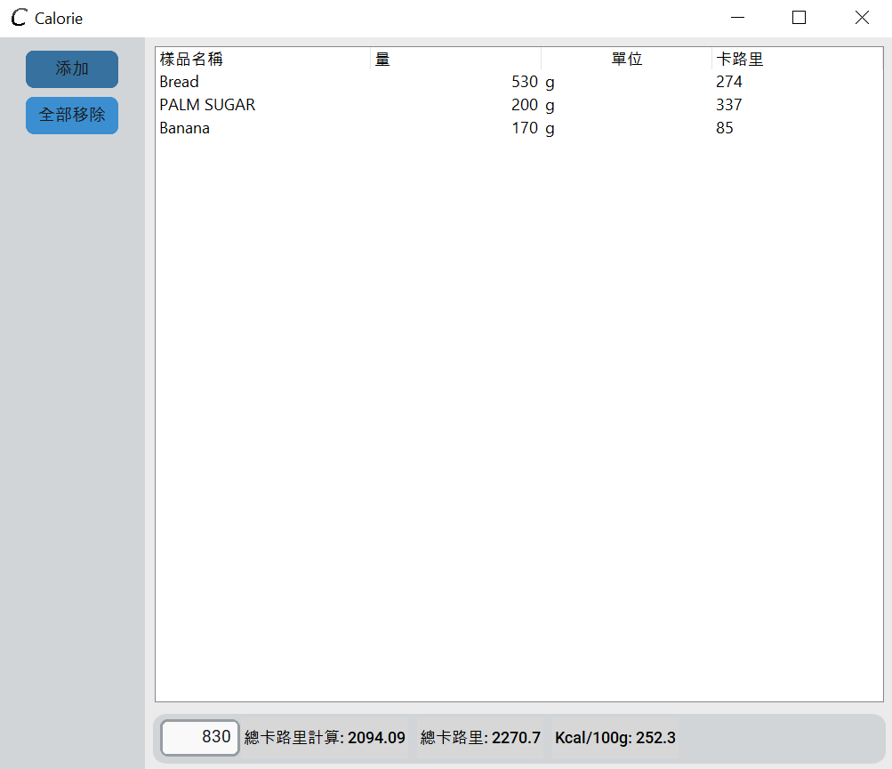
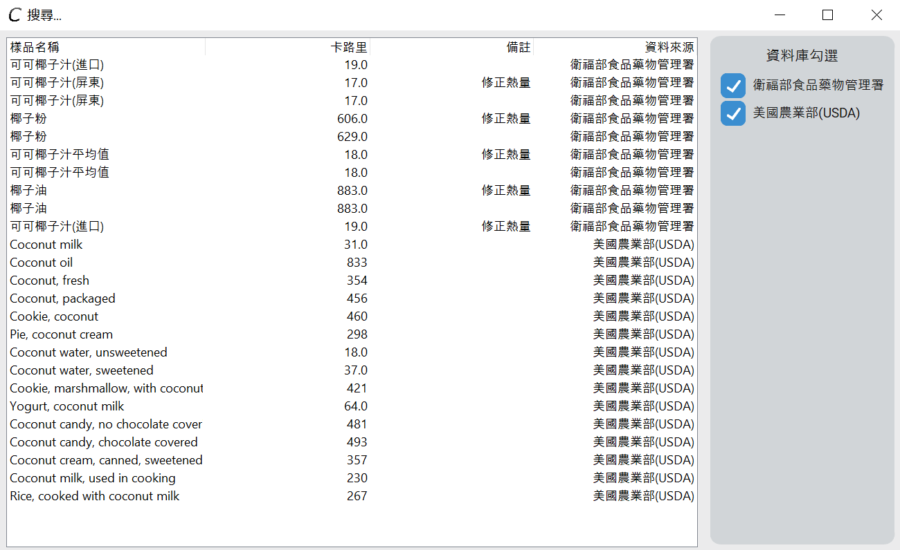

# Calorie
Calorie is a tool using the Taiwanese FDA Database as well as the USDA FDC API to calculate the total amount and calorie per 100g in a recipe.
* Language: English and Traditional Chinese
* Add your own food ingredients with their calorie
* Search up an ingredient's calorie count through the Database
* Automatically calculates the total calorie and calorie per 100g
* Calculates total calories through the designated serving size of a recipe  
# Take a look
Main Screen  
 
Searching through database  
 
# Installation
Click [HERE](https://drive.google.com/file/d/1H64awV8oiitW0BR9Nm5X3RlpgSBqrkdV/view?usp=sharing) to be redirected to download. 
This is my first app, I am still figuring out how to bypass the Microsoft Defender, which is most likely impossible.
# 1.2.0 Updates
* Added a main menu screen
* Added English Language support. The default language is now English. This could be changed in the settings
# 1.2.2 Bug Fixes
* Change settings window title
* Disable Apply button when new settings are applied
